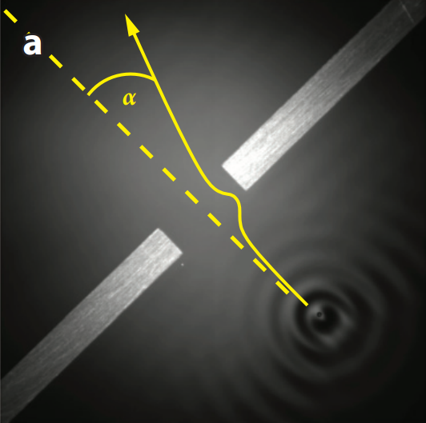
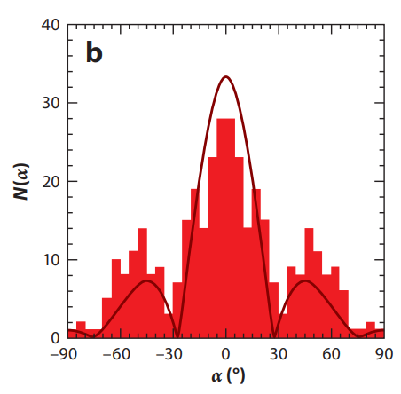
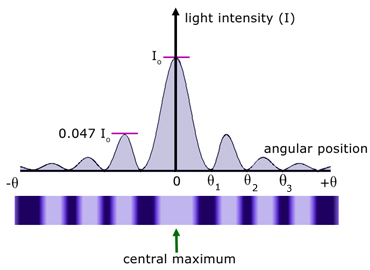
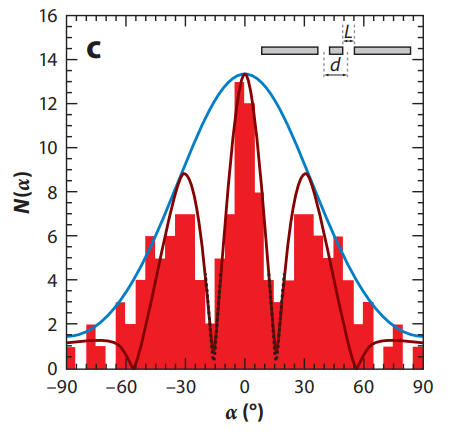

# Interference and Diffraction
Aside from quantum tunnelling, the droplets can also exhibit quantum-like effects when 
passing through small slits. The behaviour of walking droplets passing through small slits
is similar to the diffraction and interference observed for light or small particles.

Before we dive deeper into the phenomenon, I must clarify what "slits" mean in the 
context of waves and walking droplets. 

As discussed in [Quantum Tunneling](tunneling.md), a "wall" is made by making 
the fluid shallower for a small region. The waves will have a more difficult time travelling
through this shallower region and tends to be reflected back. We can make "slits" in a
similar way, by pasting a thin strip at the bottom of the container, but leaving a small 
hole in the center.

Now we can explore some interesting things that happen when the droplets pass through a
slit, or an arrangement of slits.

## Diffraction

{ width="350" }
> Taken from J. W. M. Bush, “Pilot-wave hydrodynamics,” Annu. Rev. Fluid Mech. 47, 269–292 (2015).

When a droplet "walks" towards a small slit, it doesn't just pass straight through.
After it passes through the slit, its direction will change in a seemingly random manner.
When scientists observed the path of a hundred droplets that walk through the slit, they
found that the final direction of the droplet is not actually random, it's actually similar
to the diffraction pattern observed for light!

{ width="350" }
> Taken from J. W. M. Bush, “Pilot-wave hydrodynamics,” Annu. Rev. Fluid Mech. 47, 269–292 (2015).

Diffraction is observed when waves pass through a small slit. The wave will
tend to spread out after passing through the slit, following a certain 
pattern. It is commonly demonstrated in schools using light 
rays shot through a thin slit, where the light rays will spread out
and form a unique pattern on a screen, known as a diffraction pattern.

{ width="350" }
> Taken from https://www.a-levelphysicstutor.com/wav-light-diffr.php

Early on, diffraction was only observed with waves, such as light
and sound. However, in 1924, Louis de Broglie made the bold claim 
that particles could behave like waves, in the same way that Planck 
and Einstein hypothesized that waves, such as light, can behave
like particles. His claims were not backed by direct experimental
evidence when he published his thesis, but he was proven right 
when scientists found that electrons can also be diffracted!

So how can electrons, and bouncing droplets, behave like waves? And what is the similarity
between the two?

De Broglie actually hypothesized that particles not only behave like waves, but they coexist
with a wave, even though we can only observe the particle. The particle influences the 
properties of the wave, while the wave "guides" the particle. Even though this theory is 
no longer the most commonly accepted model of quantum physics, it can explain most
quantum effects. With this model, we can see that it's not the particle that diffracts but
the wave that accompanies it. Even though the particle never touches the barriers on either
side of the slit, the guiding wave does and is reflected by the boundaries. The interference
between the reflected wave and original wave causes the wave pattern near the slit to be almost 
random, so it guides the particle to move in a random direction. It turns out that the final
direction of particles is not completely random, but follows a probability distribution. 
This is due to the constructive and destructive interference of the guiding waves causing
certain directions to be favored.

## Interference

An even more interesting phenomenon occurs when the droplets walk through one of the slits
in a double slit setup. Again, the droplet gets diffracted as it passes through the slit,
but the probability distribution of the final directions the droplet travels in is different
from when there is only one slit!

{ width="350" }
> Taken from J. W. M. Bush, “Pilot-wave hydrodynamics,” Annu. Rev. Fluid Mech. 47, 269–292 (2015).

As it turns out, the probability distribution is more similar to the double slit interference
pattern for light waves. The double slit experiment is also a common demonstration in schools,
where a laser beam is shot through an opaque sheet with 2 small slits. The two slits function
as individual sources and an interference pattern is observed on the screen, consisting of 
alternating bright and dark fringes, when the waves from the 2 slits interfere constructively
and destructively respectively.

The double slit interference requires waves from both slits, but the droplet only passes
through one slit, so how can an interferences pattern be observed?

When scientists observed the behaviour of the waves as the particle passed through the slit,
they observed that even though the particle only passes through one slit, its guiding wave
actually passes through both slits. The waves from both slits will then interfere and guide
the particle to regions of constructive interference.

## Recap

<iframe width="560" height="315" src="https://www.youtube-nocookie.com/embed/sLF7V05pW4A" title="YouTube video player" frameborder="0" allow="accelerometer; autoplay; clipboard-write; encrypted-media; gyroscope; picture-in-picture" allowfullscreen></iframe>
